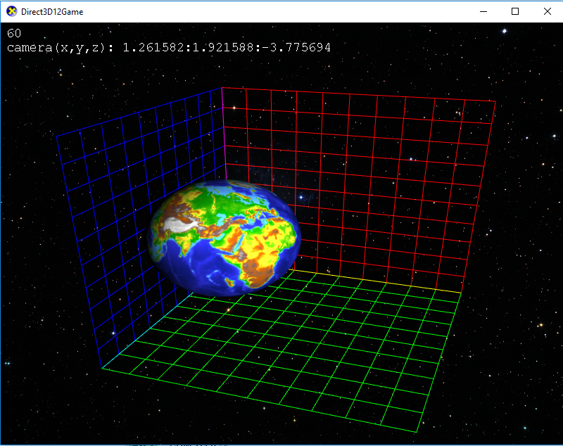

# DirectX 12 Course demo - New-Globing. 
Created By
- Joel Känsälä (Blitzdude): Camera, Background, Grid, Text and movement
- Santeri Heimovirta: Texture and Shadow.

## Simple DirectX 12 demo with a rotating earth model.
- movable camera (use wasd to move and left mouse button to rotate the camera)
- simple lighting
- earth rotates and moves
- grids show x,y and z planes from origin

# To run
Project file has been built using Visual Studio 2017. You need to use the Nuget Package Manager to download
DirectX 12 Tool Kit (Link to GitHub page [here](https://github.com/Microsoft/DirectXTK12). 
- Clone the repository
- Open solution with Visual Studio 2017
- Use Nuget Package Manger to download and install DirectX 12 Tool Kit Desktop version.
- Set Build modes to Release and x64. 

## Third Party libraries
- DirectX 12 Toolkit 
- Camera code from this Page [here](https://github.com/d3dcoder/d3d12book)
